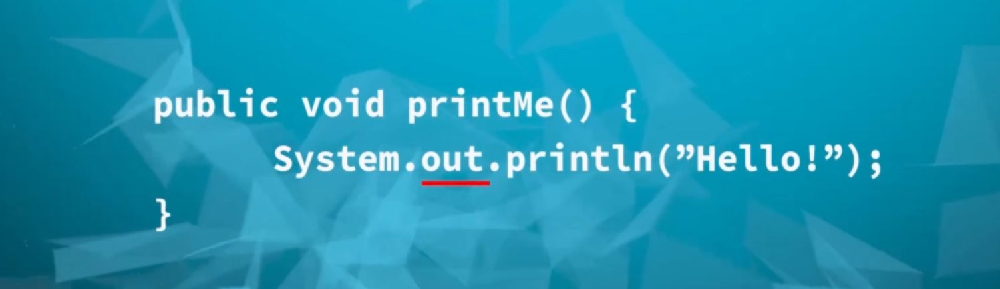
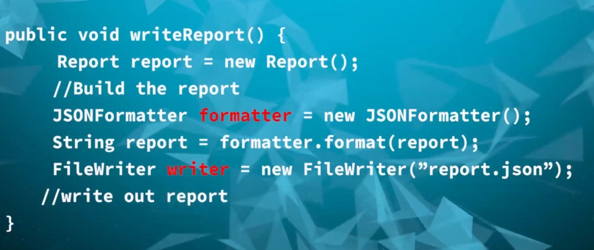
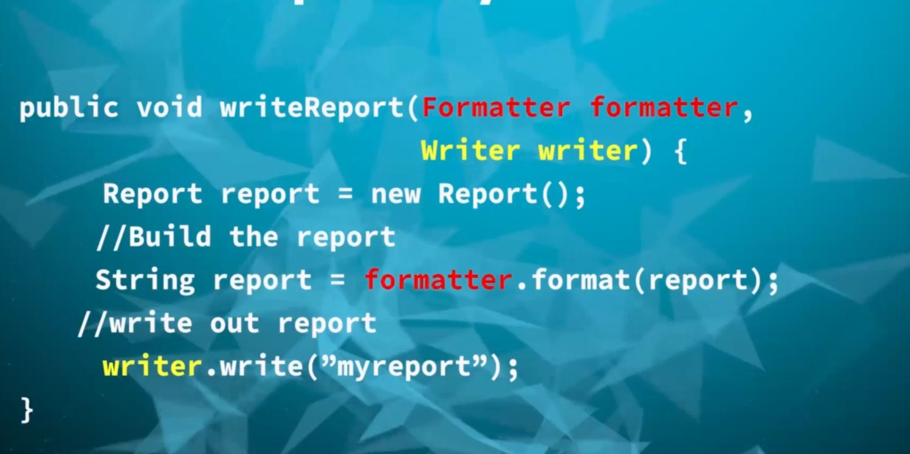

## First part and Second of Dependency Principle?
- High level modules should not depend upon low level modules. Both should depen upon abstractions.
- Abstractions should not depend upon details. Details should depen upon abstractions.

## What is Dependency? Two Examples
Let's say we are writing a code and we want to print it in java.

We just do this. Now, our code has dependency on the out object that is defined in the System class. out object is our dependency.

Say we are writing a method that generates a report in JSON format and this function will write that report on disk. What are dependency for this particular function?
So, we need a object that takes our report object and will convert it to JSON. That particular object is our dependency now. Then we need a object that takes that report string and writes it to a file in disk. So, writer object is our dependency now.

Dependency is something that we need in order to provide a functionality that we are writing code for.

## Why do we need Dependency Inversion?
Dependency Inversion is telling us do something opposite to what we typically do.
As shown before we will typically create an object of FileWriter and we will create another Object that will allow us to convert our Java Object to JSON.
We are instantiating these objects in our method that's why we are tightly coupling our report generation to these particular implementation.

Say if somebody comes and tells us we like the report but we want it in HTML format, we are going to go in the method and modify our method. if someone wants our report in a server rather than a disk. Same for this.
We are creating more possilibity of bugs this way. 

## What does Dependency Inversion principle tell?
Dependency Inversion Principle is telling us that instead of tightly coupling our high level modules.
High Level modules means a module that implements some business rules. A low level module is a functionality so basic that can be used anywhere. Writing to disk and converting java object to json is low level module.

We shouldn't tightly couple with these concrete classes. Both these object should depend on abstraction.

Here, abstraction can be as simple as a interface or other OOP solution.

# How to solve this issue of Dependency  inversion?

We are going to use interface. One interface called Writer and another interface called Formatter. We will write our high level module code using that interface.

Instead of creating new object in our method we will accept these interfaces. We will write our entire code using those interfaces. The benefit is our code is no longer tightly coupled to any concrete class. So, we will pass a different implementation of formatter and they will get report in some other format.