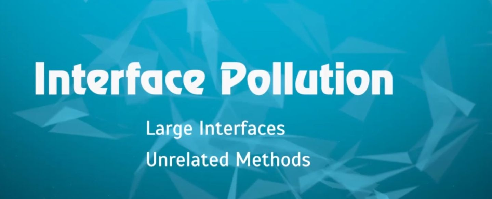
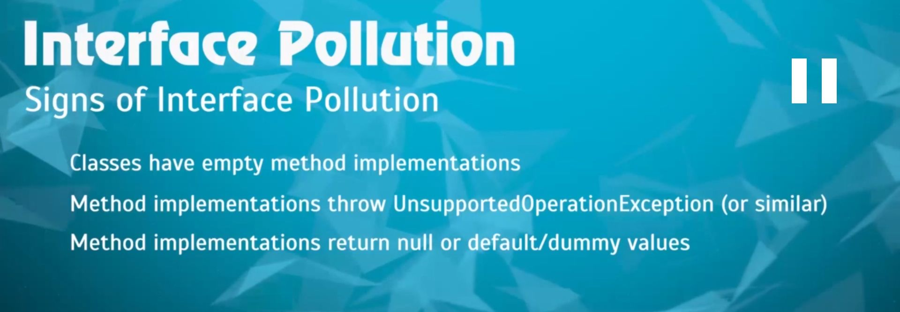

## What does Interface Segregation principle say? 
Integration Segregation Principle says that clients should not have to depend on interfaces that they don't use.

In particular we are talking about methods. Clients shouldn't have to depend on methods that are defined on the interfaces that they don't use.

## Interface Pollution
This means that we should not make our interfaces large. We should not cram methods that are unrelated in a one big interface and make all the other classes in our software system implement that interface.

## Indication of Interface Pollution
The below list are indication that we are violating Interface Segregation Principle because that particular class is implmenting an inteface which has method that makes no sense for that particular class. This is what we should avoid.

## Conclustion
This principle is telling us is to break those bigger interfaces so that the methods or behaviours or contract that are defined in a particular interface are cohesive and related to each other and we don't run into a situation where a class is forced to provide an implementation for a method for which it doesn't make any sense.