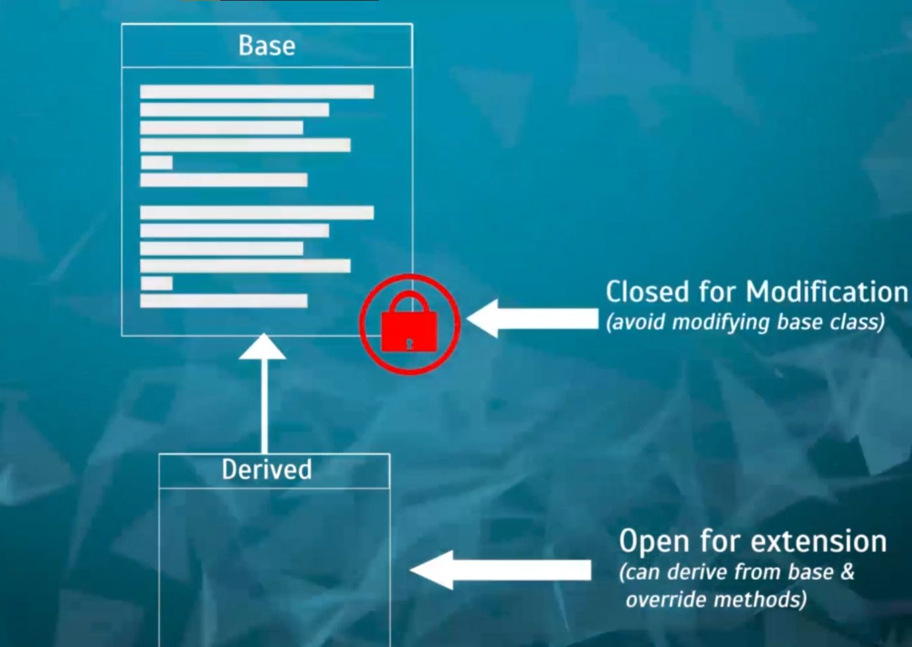

## What does Open Closed Principle Say?
It says Software Entities(Classes, Modules, Methods etc.) should be open for extension but closed for modification.

- Open for Extension: Extend existing behaviour.
- Closed for Modification: Exisiting code remains unchanged.

## Example of Open Closed Principle
If we are going to extend or modifiy behaviour of one of the methods that is written in this base class then we should be able to do that and we can do that using inheritance. This is what open for extension means.

And closed for Modification means that we shouldn't go and modify code written in the base class because that code is ideally written and tested.

