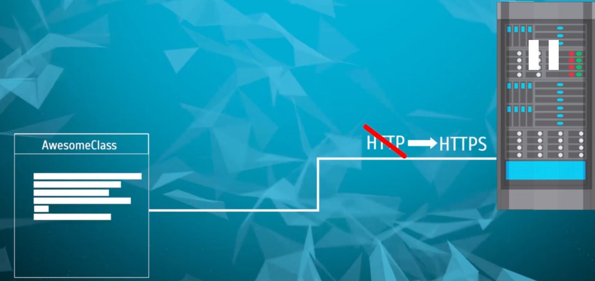
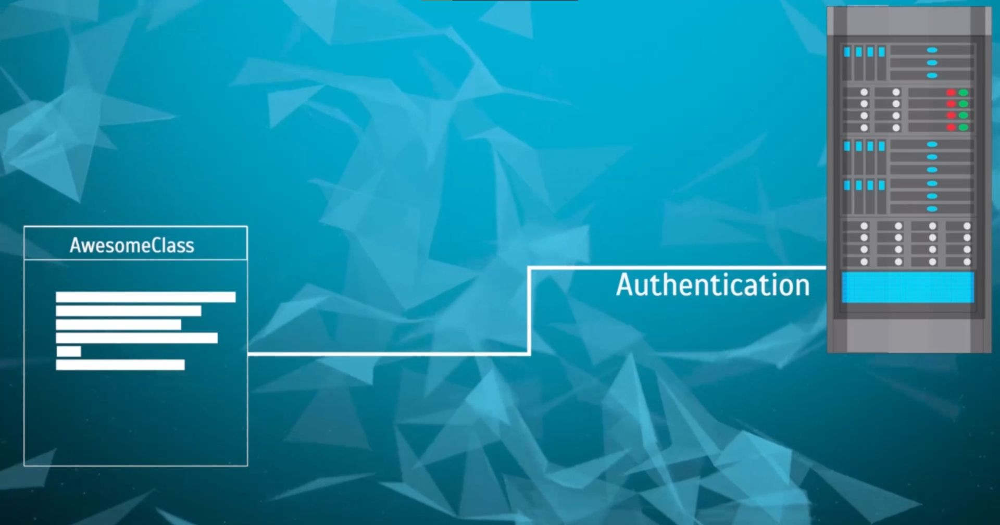

## What does Single Responsibility Principle say?
There should never be more than one reason for a class to change.

- The class provides very focused, single functionality
- Addresses a specific concern of our desired functionality.

## Example of Single Responsiblity Principle and Possible Reasons for particular class to change
Let's say we created a single class with codes and that code is creating and sending a message to a remote server that is listening on some port.

Possible reason for this particular class to change are: 

1. Communication Protocol Changes.

2. Message Format Changes.

3. Parameters of communication, say authentication logic is added. Again our class needs to change.

We have multiple reason for the code in our class to change. This is what we should avoid. If we have 3 seperate responsiblities, we should have 3 seperate classes to handle those responsibilities. So that, Whenever something changes our code can be changed in an organized manner.